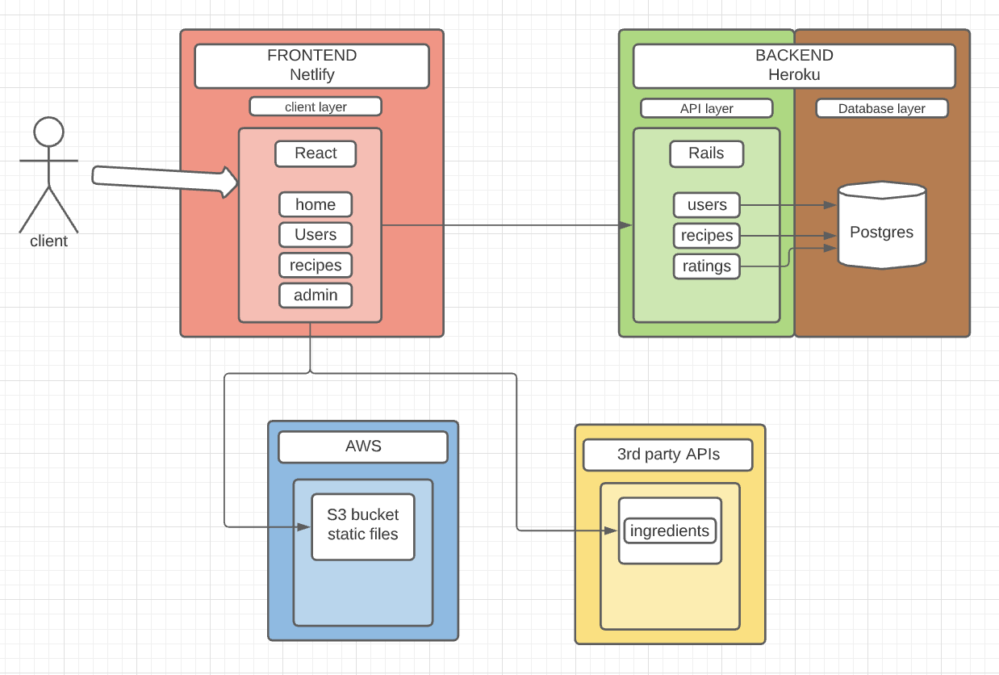

# Full stack Application with Ruby on Rails API backend and React Frontend

**IMPORTANT:** This is a Work in Progress project, it doesn't have enough instructions yet to replicate this deployment to new environments.

---

TABLE OF CONTENTS:

1. [Project overview](#1-project-overview)

2. [Backend on Heroku](#2-backend-on-heroku)

3. [Frontend on Netlify](#3-frontend-on-netlify)

4. [PaaS vs IaaS](#4-paas-vs-iaas)

5. [Application Architecture using Heroku and Netlify](#5-application-architecture-using-heroku-and-netlify)

6. [Application Architecure in AWS](#6-application-architecure-in-aws)

7. [Application deployment on AWS](#7-application-deployment-on-aws)

    - [Running Terraform](#running-terraform)

    - [Running Ansible](#running-ansible)

8. [Roadmap of new features](#8-roadmap-of-new-features)

[References](#references)

---

## 1. Project overview

This project was designed to showcase my skills in Ruby on Rails, React, JavaScript, Ansible and Terraform.

[The Food Connection]('https://github.com/The-Food-Connection') is a full-stack application developed by myself and a classmate, Suz Top, for the completion of a web development Bootcamp at Coder Academy. The idea of the application was to store favourite recipes and share them with others, as most of us were in lockdown because of COVID-19. The application runs the backend on Heroku and the frontend on Netlify.

As part of my learning process, in this project I focused on infrastructure, configuration management, DevOps, automation to practice these skills moving The Food Connection backend API from Heroku to AWS.

---

## 2. Backend on Heroku

The Food Connection backend is Ruby on Rails, PostgreSQL database, and AWS S3 bucket for storing images, and it ran on Heroku, as Bootcamp's focus was not on the application's infrastructure.

---

## 3. Frontend on Netlify

[The Food Connection]('https://the-food-connection.netlify.app/') frontend is developed in Html, Css, React, JavaScript and runs on Netlify.

---

## 4. PaaS vs IaaS

As this project was developed in a Bootcamp focused on the code development and not the infrastructure, we chose to use Heroku and Netlify to run the application's API and frontend.

As a personal project, I'm moving from Heroku (PaaS) to AWS (IaaS) as I'm currently studying and learning about infrastructure and configuration management.

I found it a good opportunity to use the application already developed to study and learn more about these concepts, making the application more flexible than hosted on Heroku.

---

## 5. Application Architecture using Heroku and Netlify



---

## 6. Application Architecure in AWS

As this is a WIP, only the left half of below architecture is implemented so far. Intention is to have the full stack being deployed and configured via code once the project is completed.


---

## 7. Application deployment on AWS

Assuming you are authenticated with your AWS account:

### Running Terraform

- Install Terraform on the machine
- Create an ssh key in AWS then add it in the backend.tf file the ssh key <key_name> so that Ansible can connect to the instance and the <master_password> to connect to the database
- From the `infra/terraform` folder, run below commands in order
  - <terraform init> to initialize the tool
  - <terraform plan> to present the run graph to build the infrastructure
  - <terraform apply> to execute the configuration files and launch the resources
  - Keep the `output` values somewhere to be used on the next step with Ansible

### Running Ansible

- Install Ansible on the machine
- From the outputs shown in the Terraform terminal, the server public IP address must be added to the Ansible inventory file

```
[backend]
<host_ips>
```

- the endpoint must be added to the host in the database.yml production block along with the username and password

```yml
  username: <username>
  password: <passwd>
  host: <host>
```

- You also need to update the Ansible task called `add ruby master key` with the correct encryption key

- From the `infra/ansible` folder, run

`ansible-playbook -i inventory backend-playbook.yml --user ec2-user --key-file /path/to/ssh-key.pem`

### Running Rails server

- Login to the instance
- From the `backend` folder, run `RAILS_ENV=production rails server`
- Now you can test the api through `http://<instance-public-ip>:3000`

---

## 8. Roadmap of new features

- Use more variables to make the code more reusable
- Create the S3 bucket to host images as part of the backend stack
- Add another stack for the frontend: bucket for static hosting or another ec2 instance with apache
- Create a pipeline to automatically deploy stacks
    - pipeline should be able to get values across from IaC to configuration management without manual steps
- Lockdown backend API to be accessible only by the frontend on port 3000

---

## References

- [Ansible](https://docs.ansible.com/ansible/latest/index.html)

- [AWS](https://aws.amazon.com/)

- [Terraform](https://registry.terraform.io/)

- [The Food Connection](https://the-food-connection.netlify.app/)
