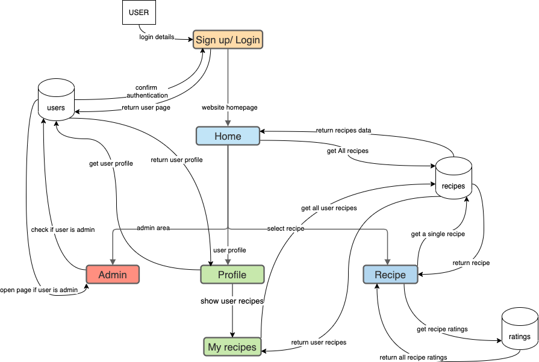

# THE FOOD CONNECTION <!-- omit in toc --> 

<br>

## T3A2 - PART B (and A) <!-- omit in toc --> 

## Suzanne Topp & Vanessa Denardin <!-- omit in toc --> 

## CODER ACADEMY July 2021 <!-- omit in toc --> 

---

TABLE OF CONTENTS
- [INSTALLING THE APP](#installing-the-app)
- [TESTS](#tests)
- [WEBSITE PAGES](#website-pages)
- [PART A DOCUMENTATION](#part-a-documentation)
- [PURPOSE](#purpose)
- [FUNCTIONALITY](#functionality)
- [FEATURES](#features)
- [TARGET AUDIENCE](#target-audience)
- [TECH STACK](#tech-stack)
- [ERD](#erd)
- [DATAFLOW DIAGRAM](#dataflow-diagram)
- [APPLICATION ARCHITECTURE DIAGRAM](#application-architecture-diagram)
- [USER STORIES](#user-stories)
- [WIRE FRAMES](#wire-frames)
- [PLANNING OVERVIEW](#planning-overview)
- [PROJECT MANAGEMENT SCREENSHOTS AND DIARY](#project-management-screenshots-and-diary)


## **FOOD CONNECTION DEPLOYED SITE**

https://the-food-connection.netlify.app/

## **HEROKU SITE FOR BACK END**

https://food-connection.herokuapp.com/

**GITHUB REPOSITORY FOR DOCUMENTATION**

https://github.com/The-Food-Connection/foodconnection-docs

**GITHUB REPOSITORY FOR API - BACK END**

https://github.com/The-Food-Connection/foodconnection-api

**GITHUB REPOSITORY FOR CLIENT - FRONT END**

https://github.com/The-Food-Connection/foodconnection-client

---

# INSTALLING THE APP

### Dependencies <!-- omit in toc --> 

* <a href="https://www.ruby-lang.org/en/">Ruby 2.7.2</a>
* <a href="https://reactjs.org/">React</a>
* <a href="https://yarnpkg.com/">Yarn</a>
* <a href="https://nodejs.org/en/">Node</a>
* <a href="https://www.postgresql.org/">Postgresql</a>

### **How to Install** <!-- omit in toc --> 

- Clone Both API and CLIENT Repositories to your local machine. (Visit each page, select the cloning option top right, and copy the link given.  Open Terminal on your local machine. Create a directory called foodconnection and cd into it, then run **'git clone -clone line-'** for each of the clone lines)

- Once the clone has run, **ls into the folder** it creates for both api, and client.

- Run **yarn install** for the **client side**, this will install all necessary packages.

- Some environment configurations are required to run the backend, like:

  - AWS IAM conmfiguration to be able to access the S3 Bucket
  - JWT token is required to configurated api authentication

```yml
aws:
  access_key_id: <add value>
  secret_access_key: <add value>

jwt_secret_key: <add value>
```

- For the AWS S3 Bucket work it need to configure bucket main `app/config/storage.yml`

- Run **bundle install** for the **api side**, this will install all necessary gems.

- Follow this in the api side by running rails db:create, followed by rails db:migrate, followed by rails db:seed, this will create the test users and recipes/ratings including the dietary categories. 

### **How to Run Tests** <!-- omit in toc --> 

- To be able to run the **RSpec** test in the api, in the folder you ran bundle install in, run the command line code '**rspec -fd'**. This will run the tests that are set up for the api, and will show the successful tests and their purpose.

- We have included Cyrpress screen shots of tests run below.

To use the site in production mode, as opposed to with the deployed link, you will need to run rails s in the api folder, and then run yarn start in the client folder in the command line. This will then open up the local host 8080 front end of the project.  To view the back end in the browser go to localhost:3000.

Enjoy!

**USING THE SITE AS A CUSTOMER**

Navigate to the login page (which will load when you click the above deployed link).  To log in as user the username is testaccount, with a password of 123456.  This will allow you to view the page as a standard user.

**USING THE SITE AS A ADMIN**

Navigate to the login page again, and log in with the username testaccount3, password testadmin.
Admin will enable the Admin dashboard, where you can view all users, recipes, and ratings on the site, with the option to remove any offensive ratings, and to deactivate user accounts if necessary. 

**API DEPENDENCIES**

    DEPENDENCIES
      aws-sdk-s3 (~> 1.96)
      bcrypt (~> 3.1.7)
      bootsnap (>= 1.4.4)
      byebug
      excon (~> 0.85.0)
      factory_bot_rails
      jwt (~> 2.2)
      listen (~> 3.3)
      pg (~> 1.1)
      puma (~> 5.0)
      rack-cors (~> 1.1)
      rails (~> 6.1.4)
      rails-controller-testing
      rspec-rails (~> 5.0.0)
      spring
      tzinfo-data

**CLIENT SIDE DEPENDENCIES**

    "dependencies": 
      "@hookform/resolvers": "^2.6.1",
      "@material-ui/core": "^4.12.2",
      "@material-ui/icons": "^4.11.2",
      "@material-ui/lab": "^4.0.0-alpha.60",
      "@testing-library/jest-dom": "^5.11.4",
      "@testing-library/react": "^11.1.0",
      "@testing-library/user-event": "^12.1.10",
      "bootstrap": "^5.0.2",
      "material-ui": "^0.20.2",
      "mdb-react-ui-kit": "^1.1.0",
      "mdbootstrap": "^4.19.2",
      "mdbreact": "^5.1.0",
      "react": "^17.0.2",
      "react-bootstrap": "^1.6.1",
      "react-dom": "^17.0.2",
      "react-hook-form": "^7.11.1",
      "react-icons": "^4.2.0",
      "react-paginate": "^7.1.3",
      "react-router-dom": "^5.2.0",
      "react-scripts": "4.0.3",
      "web-vitals": "^1.0.1",
      "yup": "^0.32.9"

    "devDependencies": 
      "cypress": "^8.0.0",
      "start-server-and-test": "^1.13.0"
    
---
# TESTS

## RSPEC

```ruby
Finished in 0.37687 seconds (files took 1.42 seconds to load)
26 examples, 0 failures

suziiiiiq@ubuntu:~/Desktop/FOODCONNECTION/foodconnection-api$ rspec -fd

RatingsController
  GET index
    has a 200 status code

RecipesController
  GET index
    has a 200 status code

UsersController
  GET index
    has a 200 status code

Rating
  has a valid factory
  validations
    is invalid without a rating score
    is invalid without a review
    is invalid without a date

Recipe
  validations
    is invalid without a recipe name
    is invalid without a recipe name
    is invalid without recipe instructions
    is invalid without a cooking time
    is invalid without serves
    is invalid without a skill level
    is invalid without a cuisine
    is invalid without a meal type

User
  has a valid factory
  validations
    is invalid without a username
    is invalid without an email
    is invalid without a password
    is invalid without a password confirmation
    is invalid without an @ symbol
    is invalid without a .com on the email address

Ratings
  GET /ratings
    should respond with 200 ok
    should respond with json

Recipes
  GET /recipes
    should respond with 200 ok
    should respond with json

Finished in 0.40113 seconds (files took 1.04 seconds to load)
26 examples, 0 failures
```

<br>

<br>


## CYPRESS

To run cypress, both `rails s` and `yarn start` need to be running on terminals for then tests can run successfully.

<br>

<br>

<br>

## MANUAL TESTING

[GOOGLE DOCS LINK - MANUAL TESTING](https://docs.google.com/spreadsheets/d/1aiJIk7xkHHAOo1lNhM1I1_1bkyNkH71swNVHkw3LBeA/edit?usp=sharing)

[GOOGLE DOCS LINK - SCREEN RECORDING TEST](https://drive.google.com/file/d/19DMP-1RKS_Sek6ZpAow6yw6dRqL2f_HR/view?usp=sharing)

[GOOGLE DOCS LINK - SCREEN RECORDING TEST](https://drive.google.com/file/d/1zU05dsy_c121j_zEcHV00bbV4PorRLQL/view?usp=sharing)

---
# WEBSITE PAGES

<br>

<br>

<br>

<br>

<br>

<br>

<br>

<br>

<br>

<br>

<br>

---

# PART A DOCUMENTATION

# PURPOSE

‘The Food Connection’ ……. Food for Everyone.

When thinking about a business model for a web application, we discussed the things that have hit society the most in the last 2 years.  COVID19 changed the way many Australians think about being home together, and what you can do as a family or friend unit that creates joy and positivity.  The answer to that has revolved around food.  If you search online Tik Tok and YouTube are filled with beautiful videos where people make food for you to either make it along with them, or to just relax watching.  Our idea for ‘The Food Connection’ was born from this need for connection in your kitchen at home, where you might be cooking alone, or not be able to order in food for something special to brighten your week.

We wanted to create a place where you could store your favourite recipes, and refer to them easily later.  Where you can house your ancient family recipes that mean so much, and allow your friends and family to sign up and access them easily too. 

There are other applications around online currently that offer similar services to what we want to offer, but we found they have an Ecommerce approach, where the main goal is to sell a product. ‘The Food Connection’ is about the connection food brings between people, and how important that can be for people that are struggling with isolation or are unable to go out and buy food easily.  Using what you have in your pantry to create something your family can enjoy is priceless.  

Our goal is to create a place where you can save and use your own recipes, but also take inspiration from other recipes you may have never seen.  Whether it’s a stranger from another country, or your friends and family, you can find recipes to try out without feeling the pressure of needing to purchase anything.

Enjoy The Connection of Food.....

---

# FUNCTIONALITY

- *Website usability* - allows the user to visit different pages that bring different content on the same theme.

- *Navigation function* - located at the top of the browser's page, a navigation bar should allow users to discover the site and easily find what they want.

- *Navigation function for mobile* - as on a mobile device, it is more difficult to show the full main menu due to the screen size, the hamburger menu function allows to encapsulate the main menu content, showing only the full main menu when the user clicks on it.

- *Search function* - to help users who know exactly what they're looking for on the site, allowing them to take control of their site experience.

- *Call-to-Action button* - add buttons to pages, guiding visitors on what to do next and helping them on their journey through the site.

- *Logo* - easy-to-remember visual images that provide users to make a link between the site and that image.

- *Rating* - including a review/rating section after posting the recipe, allowing visitors to interact in a discussion that shows how the recipe was made by other users in their homes.

- *Easily readable* - use fonts that allow visitors to read the content more easily.

- *Mobile responsiveness* - as more and more users access the Internet through their mobile devices, a website needs to show screens of all sizes and functionality working properly. - THIS IS A WORK IN PROGRESS AND THE HARDEST THING FOR FUNCTIONALITY THAT WE HAD TO FACE AFTER THE LOGIC

- *Contrast colors scheme* - considering the right contrast between background and site content makes the content easier to read, which positively contributes to the user experience.

- *Forms* - allow users to interact with the site, whether registering, adding a new recipe, editing, rating and reviewing the recipe, as they are easy to use and accessible to all users.

- *Banner image/ Images* - header image or body image giving visitors a visual as images hold attention by being easier to handle than large text.

- *Homepage using card design* - distribute info in a visual way to client/visitor easily consume part of the content.

- *Footer* - features secondary navigation, contact information, social media links.

---

# FEATURES

- *Sign up page* - personalized registration page to facilitate user access and better use of the site.

- *User registration* - make easier user interaction with the website.

- *Login page* - customized login page for quick and easy user access.

- *Homepage* - all recipes added to the site and a banner showing a random recipe every day.

- *Recipe page* - single recipe information provides in detail the author's name and ratings, if available.

- *My recipes page* - set of recipes added by logged in user providing options for updating information.

- *Nav bar* - displays available pages at the top of all pages for easy access on the site

- *Hamburger menu on mobile site* - keeping cleaner and organizing menu display for small screens.

- *Author's name* - visitors occasionally want to know more about the user writing the recipe, this creates a connection to the user on the other end, potentially encouraging a return for a new recipe.

- *Rating page* - include some things users have said about the rated recipes posted on the site.

- *Search bar* - search feature helping the user to explore the site.

- *Select by category* - feature helping user personalize the search in the site.

- *Call-to-Action buttons in all pages* - in "subscribe", "add a new recipe", "visit the recipes page", "evaluate a recipe" guiding users on their journey through the site

- *Homepage banner image of th recipe of the week/month* - homepage header image of a random recipe to holds users atention.

- *Homepage image cards* - list of all site recipes presented as a picture card to arouse user interest.

- Bootstrap UI

---

# TARGET AUDIENCE

Due to the covid-19 pandemic, everyday life changed completely, especially in regions where lockdowns were implemented to try to cease the spread of the virus. Then countless people lost their jobs or started working or studying from home, some restaurants were affected by going bankrupt or temporarily closing.

These people who had their lives affected began to look for alternatives to save money or to increase the connection between their loved ones at home, one of them was searching on the internet for recipes to cook, to learn to cook, to spend the free time developing a new hobby.

The number of websites or social media pages focused on sharing food recipes has grown in recent months. Although competition is high due to numerous recipe sharing websites, this application does not seek to market recipes, but to benefit users by being like an online cookbook in which the user can not only share their own recipes, but also save recipes from other users, rating and reviewing other recipes.

People who have extra time and want to store family's recipes that they can then find easily later. 

People who would like to share good recipes with others who share the same taste or culture and would like to reduce the stress of the lockdown, cooking a childhood memory that would bring comfort.

People who would like to learn different recipes, as they have more free time or the restaurants in their areas closed. They stay at home with family members during lockdowns and want a variety of meals.

People who look for recipes online and test at home as a hobby, a way of improving cooking skills or just to try new and different flavours.

People who want to innovate in the kitchen cooking different recipes and improve their cooking skills and surprise their family with a new meal.

People who want to research popular recipes between users through comments and ratings to start a new food business.

We want it to be for EVERYONE who loves food.

---

# TECH STACK

**FRONT END** - HTML5, CSS3, REACT, JAVASCRIPT, JSX, BOOTSTRAP, MDBOOTSTRAP

**BACK END** - RUBY ON RAILS, RUBY

**DATABASE** - POSTGRESQL

**DEPLOYMENT** - FRONT END - NETLIFY, BACK END - HEROKU

**TESTING** - BACK END - RSPEC & MANUAL TESTING, FRONT END - CYPRESS AND MANUAL TESTING

**PROJECT MANAGEMENT** - TRELLO FOR TASK MANAGEMENT, GOOGLE DOCS DIARY, FOLDERS AND CHECKLIST FOR MORE PADDED OUT PLANNING

**UTILITIES** - BALSAMIQ, LUCID, DIAGRAMS.NET, COOLORS, FIGMA, UNSPLASH, ICONS8

**DEVOPS** - GIT, GITHUB, VS CODE

---

# ERD

WE UPDATED OUR ERD DURING THE BUILD PROCESS

The `user` table is related to `recipe` and `rating` tables, as a user with an account on the website can post recipes as well as ratings and comments on another user's recipe.

The `recipe` table is related to `rating`, `user`, `dietary_category` and `recipe_ingredient` tables. As dietary_categories support a many-to-many relationship with recipes, a intermediate table have been added to connect them, ie `recipe_dietary` act to intermediate the relationship making it easier to handle database content.

The Food Connection in terms of the model's relationships and associations:

A user `has_many recipes and ratings` and `has_secure_password`

```ruby
    has_many :recipes, dependent: :destroy
    has_many :ratings, dependent: :destroy
    has_secure_password
```

A recipe `has_many ratings, recipe_ingredients and dietary_categories`, while rating `belongs_to user` and `has_one_attached image`.

```ruby
  belongs_to :user

  has_many :recipe_ingredients, dependent: :destroy

  has_many :recipe_dietaries, dependent: :destroy
  has_many :dietary_categories, through: :recipe_dietaries

  has_many :ratings, dependent: :destroy
  has_one_attached :image, dependent: :destroy
```

A recipe `has_many dietary_category` through `recipe_dietary`

A recipe `has_one_attached image`

```ruby
  belongs_to :recipe
  belongs_to :dietary_category
```

The model `recipe_dietary` is collecting information about the dietary_category table to link to the recipe table.

```ruby
  belongs_to :recipe
```

The model `recipe_ingredient` is to link to the recipe table and handle ingredients from a CSV file.


To add ingredients to the recipe page, we used an ingredients list saved in a CSV file from the Internet, so the ingredient table was not needed. Instead, the row name was added to the table recipe_ingredients which was serving the application with ingredients.

It was also decided to implement an option to disable the user by the administrator, to serve as an option to delete it in case of need without completely losing all the data entered by the user. For this, the disabled line was also added to the users table, giving the admin the possibility to block the user's access to the site without losing all the data added by him.

<br>

---

# DATAFLOW DIAGRAM

<br>

The Food Connection user, once registered, can log in by entering their username and password, receiving access to the website's resources as output so that they can start the journey through the website. If the user is registered as an admin, having free access to the entire content of the site as output and being able to delete content or users if necessary.

As soon as the user accesses the homepage, all recipes will be requested from the database, populating the homepage. From there, the user can access a specific recipe of their choice, which also retrieves the information from the database, leading them to a new page.

In addition, the user can access the "My Recipes" page, which retrieves from the database all recipes already added by the user, showing them on the page. If the user has not added any recipes, this page will be empty.

---

# APPLICATION ARCHITECTURE DIAGRAM

<br>

This 2-layered application architecture presents the Heroku (backend + database) and Netlify (frontend). Netlify will handle the React.js components and will correspond to the client layer having the views of the website. Heroku will manipulate Rails controllers and models, as well as PostgreSQL database equivalent to API and database layers.

Cloud technology, such as the AWS S3 bucket for storing images attached to recipes on website pages, is being used to provide additional support for the application. And third-party APIs to add information that facilitates the best use of some functionality of the website by the user, such as adding ingredients when filling out the recipes page.

---

# USER STORIES

### **USERS WANTING TO UPLOAD RECIPES** <!-- omit in toc --> 

As a mom, I want to share my recipes with my children so they can cook at their homes.

As a restaurant owner, I want to share my recipes so the customers of my restaurant can reproduce my best sellers at home.

As a chef, I want to store my recipes so I can make a collection of recipes.

As an international student, I want to store my favourite recipes so I can prepare them when I'm living abroad.

As a family member, I want to store grandma's recipes so that all members of my family can access them.

As a new user, I want to create an account so I can access it often to upload my recipes.

As a user, I want to store my favourite recipe so other users can connect with other users with similar tastes.

As a user, I want to choose the right cuisine so others can understand the background of the recipe.

As a user, I want to easily find the pages available for me so I can understand the website proposal.

As a user, I want to submit my recipe so I can find it on my recipes page.

As a user, I want to see the recipe's rankings so I can choose one to cook tonight.

As a user, I want to save my favourite recipes so I can access them during the week for a variation on dinner.

<br>

### **USERS WANTING TO FIND A RECIPE** <!-- omit in toc --> 

As a mom, I want to find a recipe so I can cook a different family meal.

As a restaurant owner, I want to find a popular recipe so I can add in my restaurant's menu.

As a chef, I want to find a new recipe so I can improve my skills.

As a student living by myself, I want to find a recipe so I can use the ingredients that I have in the fridge.

As a family member, I want to find a new recipe so I can cook tonight for the family meal.

As a member of a group of friends, I want to find a breakfast recipe so I can make it tomorrow morning for our meeting.

As a new user, I want to create an account so I can visit different recipes.

As a new user, I want to read about the recipe of the week so I can cook during the weekend.

As a user, I want to search for a recipe to find the one that matches my weekend event.

As a user, I want to save the recipe from last night so I can cook it again next month.

As a user, I want to find a recipe that matches my dietary requirements so I can cook a safe dish.

As a user, I want to search for a specific cuisine so I can cook a different meal for my family.

As a user, I want to find a well rated recipe so I can cook something delicious for my family tonight.

As a user I want to search for some dessert so I can prepare something to take to my friend's house tomorrow.

<br>

### **USERS WANTING TO INTERACT VIA REVIEWS** <!-- omit in toc --> 

As a mom, I want to leave a review so I can share my experience doing that dish.

As a chef, I want to leave a review so I can share useful tips for other users.

As a family member, I want to leave a comment so I can share my family's opinion after eating that dish.

As a student living by myself, I want to leave a comment on my favourite recipes so other users can try to cook it at home.

As a user, I would like to read some reviews of the best recipes on the site so that I can choose the most suitable dish for my dinner.

As a user, I want to select the best recipes so I can cook something delicious at home this weekend.

As a user, I want to save the highly-rated recipe so I can try it at home someday.

<br>

### **USERS WANTING THE CONNECTION OF REVIEWS** <!-- omit in toc --> 

As a user, I want to read the reviews that others left in my recipes so I can understand their perception.

As a user, I want to see the reviews that I wrote so I can select the ideal dish for tonight.

As a user, I want to know the best review in my recipes' list to prepare me for my weekend event.

As a user, I want to read the comments to get an overview of the perception about the last recipe I added.

<br>

### **ADMIN** <!-- omit in toc --> 

As the admin, I want to know how many users created an account in the last month so I can understand the success of the website.

As the admin, I want to know how many users have unsubscribed in the last month so I can understand what is failing.

As the admin, I want to understand what users are expecting from the site so I send surveys regularly.

As the admin, I want to disable a user account as the user broke the rules.

---

# WIRE FRAMES

We used Balsamiq to create our Wireframes.  This allowed us to have low fidelity wireframes, with all the visualations we needed to start creating our app in react. We could also create the journey between elements on each page, and export them to an interactive pdf. The process of creating these relationships allowed us to realise we had missed key design elements, or necessary wireframes needed to complete the user experience. 

DURING BUILD - we tried to stick to wire frames as much as possible within our styling knowledge base

<br>

<br>

<br>

<br>

<br>

<br>

<br>

<br>

<br>

<br>

<br>

<br>

<br>

<br>

**PROTOTYPE DOCUMENT - PDF showing Prototype Journey**

[GOOGLE DOCS LINK - FOOD CONNECTION INTERACTIVE PDF](https://drive.google.com/file/d/1WcVNIM-IMCi0MPm1Yjb2B5dekNyYAEgG/view?usp=sharing)

---

# PLANNING OVERVIEW

The Food Connection is a project managed with Agile methodology. The overall plan for the team from the beginning was to work together for the documentation, then branch out to features when coding the api and client. We were lucky enough to spepnd the first four real project days together, so worked separately at night on documentation in our Google Docs folders based on the split we decided during the day, then came together to work on creating our api in person. This allowed us to really plan solidly how we wanted to move forward when we split. 

We documented our progress from that point in both Trello visually, and in a written daily diary of what we achieved, what issues we had and what we were moving towards working on.

We wanted to break the process down into chunks, then tackle those depending on what strengths fell where.  Vanessa worked a lot of the diagrams side of the Readme, while I worked on the wire frames and the logo and the Readme setup. We didn't approach anything as as sprint until we started coding and went into lockdown and had to work completely remotely. This meant we needed to be fully on top of when tasks were being created and finished.

For the feedback side of the project, we worked with fully shared tasks, ie. we screen shared in VS Code, we project shared in Trello, and we had access to a Google Docs folder where all our documentation and diagrams were housed.  We shared access to any diagram creating sites as well so we could work simultaneously. We then created an Organisation folder in GitHub where we stored three repositories where we both had full access. This meant we were consistently talking to each other about our tasks, and fully accross what we could be. The only extra we would have liked was access to shared wire frames, but were not able to have the shared advantage in there on our student membership. 

Our plan for the app build is to utilise Git branches for our features.  We will plan these at the start of each day, as the final time left for our project after Part A is the length of one sprint (minus a few days). We will plan the entire sprint as well on the Monday, but due to being remote we want to stay in touch as regularly as possible.  The ability to share our VS Code and local servers will mean we are constantly in contact with eachother and able to give feedback and help as we go. We are going to simulate the role of the client, and keep that in mind when querying the components in react, and the various elements on the page. Discussing why we are making the choices we are, and how those choices will effect the output and overall project should help us think how we would if were in regular contact with our client. 

---

# PROJECT MANAGEMENT SCREENSHOTS AND DIARY

TRELLO LINK

https://trello.com/b/fd1hUd20/rails-react-app

FIRST WEEKEND

<br>

12th JULY 2021

<br>

<br>

13th JULY 2021

<br>

<br>

14th JULY 2021

<br>

15th JULY 2021

<br>

16th JULY 2021

<br>

17th JULY 2021

<br>

**PART B TRELLO UPDATES ARE IN THE TRELLO BOARD**

https://trello.com/b/fd1hUd20/rails-react-app

**DAY BY DAY DIARY OF FULL PROJECT (PART B)**

https://docs.google.com/spreadsheets/d/1-GgdEfiidiHSRH7jBYNp9grX8EM-QEGI3NYyMCPJ1Ws/edit?usp=sharing

https://docs.google.com/spreadsheets/d/1ywwT4aPi40I_p4o5sl6DZfYnedBeh8RetuDOj8dphSU/edit?usp=sharing

***THE FOOD CONNECTION***

---

© Suzanne Topp & Vanessa Denardin - July 2021 - Coder Academy T3A2 Final Full Stack Group Project

<a href="https://github.com/suztopp">Suzanne Topp</a>

<a href="https://github.com/vanessadenardin">Vanessa Denardin</a>
